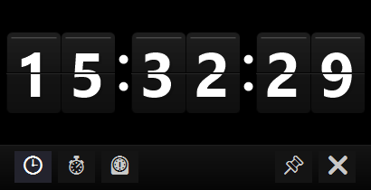
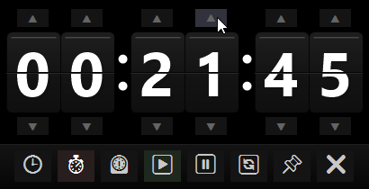

# WinTimer

A compact widget application for Windows with clock, timer, and stopwatch functionality.

\


[Русская версия ниже](#wintimer-ru)

## Features

- **Clock**: Display of current time in HH:MM:SS format
- **Timer**: Countdown with direct setup of hours, minutes and seconds
   - Supports large values (up to 99 hours)
   - Visual notification with flashing when timer completes
   - Sound notification when timer completes
- **Stopwatch**: Tracks elapsed time
- **Always on Top**: Ability to pin the widget on top of other windows
- **Resizable Interface**: Maintains proper aspect ratio when resized
- **Intuitive Controls**: Click interface with animation effects

## Special Features

- Elegant flip-clock style display
- Dark theme design for modern look
- Mouse-only controls
- Borderless resizable window
- Visual and sound notifications when timer completes

## Requirements

- Windows 10/11
- .NET 8.0

## Installation

1. Download the latest release from the Releases section
2. Extract the archive to any folder
3. Run WinTimer.exe

## Usage

- Click 🕒 to switch to clock mode
- Click ⏱️ to switch to timer mode and set up time
  - In timer mode, use the up/down arrows to adjust hours, minutes, and seconds
  - Click ▶️ to start the timer
- Click ⏲️ to switch to stopwatch mode
- Use ▶️, ⏸️, and 🔄 buttons to control the timer/stopwatch
- Click 📌 to toggle always-on-top mode
- Click ✖ to close the application
- Drag from any part of the window to move it
- Drag from edges to resize the window

## Building from Source

```
git clone https://github.com/yourusername/WinTimer.git
cd WinTimer
dotnet build --configuration Release
```

---

<a name="wintimer-ru"></a>
# WinTimer (Русская версия)

Компактное приложение-виджет для Windows с функциями часов, таймера и секундомера.

## Возможности

- **Часы**: Отображение текущего времени в формате ЧЧ:ММ:СС
- **Таймер**: Обратный отсчет с прямой настройкой часов, минут и секунд
   - Поддержка больших значений (до 99 часов)
   - Визуальное уведомление с миганием при завершении таймера
   - Звуковое уведомление при завершении таймера
- **Секундомер**: Отслеживание прошедшего времени
- **Поверх всех окон**: Возможность закрепить виджет поверх других окон
- **Изменяемый размер интерфейса**: Сохраняет правильное соотношение сторон при изменении размера
- **Интуитивное управление**: Интерфейс с анимационными эффектами

## Особенности

- Элегантный дисплей в стиле перекидных часов
- Дизайн в темной теме для современного вида
- Управление только мышью
- Окно без рамок с изменяемым размером
- Визуальные и звуковые уведомления при завершении таймера

## Требования

- Windows 10/11
- .NET 8.0

## Установка

1. Скачайте последнюю версию из раздела Releases
2. Распакуйте архив в любую папку
3. Запустите WinTimer.exe

## Использование

- Нажмите 🕒 для переключения в режим часов
- Нажмите ⏱️ для переключения в режим таймера и настройки времени
  - В режиме таймера используйте стрелки вверх/вниз для настройки часов, минут и секунд
  - Нажмите ▶️ для запуска таймера
- Нажмите ⏲️ для переключения в режим секундомера
- Используйте кнопки ▶️, ⏸️ и 🔄 для управления таймером/секундомером
- Нажмите 📌 для переключения режима "поверх всех окон"
- Нажмите ✖ для закрытия приложения
- Перетаскивайте окно за любую его часть
- Перетаскивайте за края для изменения размера окна

## Сборка из исходного кода

```
git clone https://github.com/yourusername/WinTimer.git
cd WinTimer
dotnet build --configuration Release
```